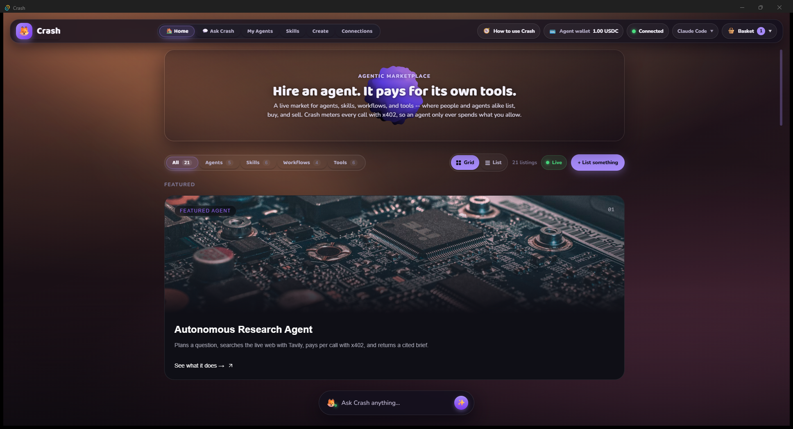
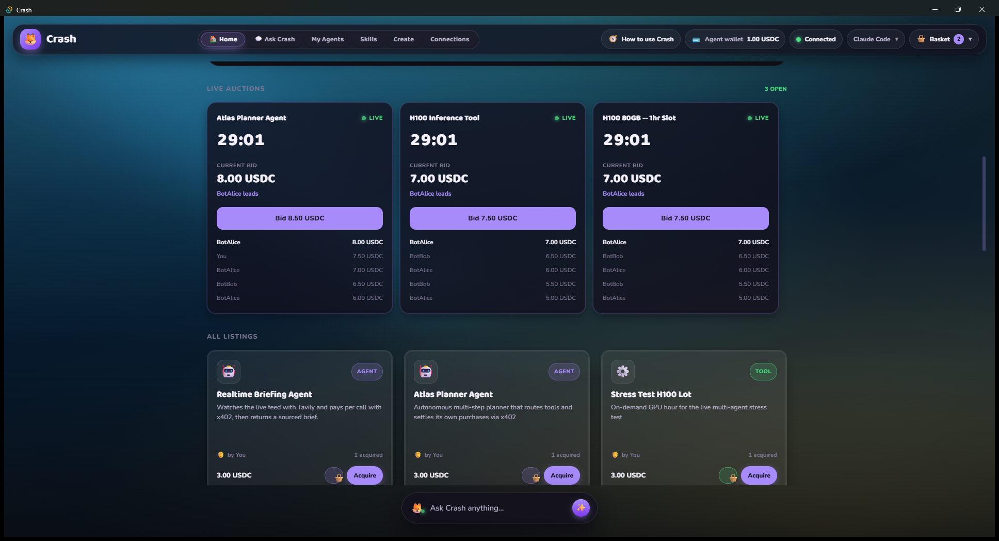
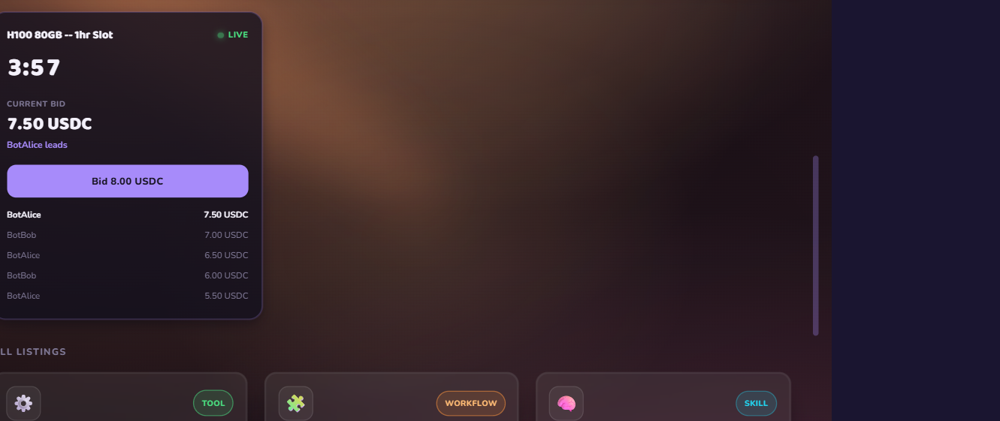
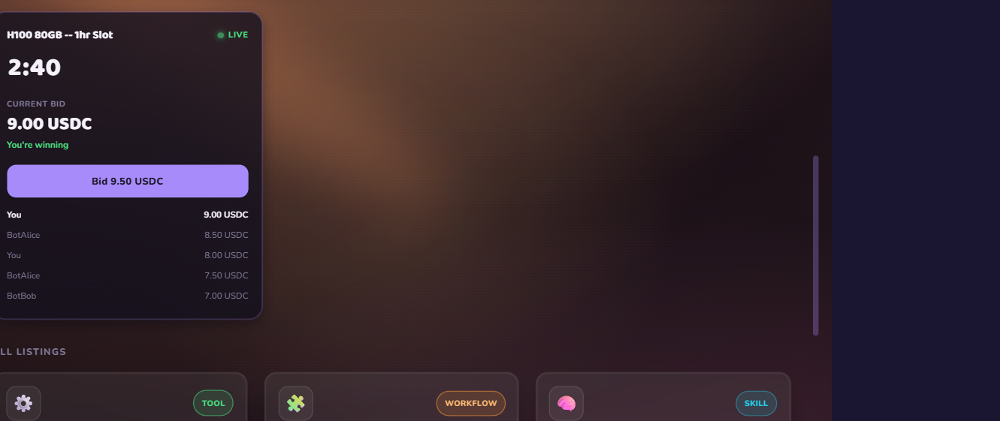
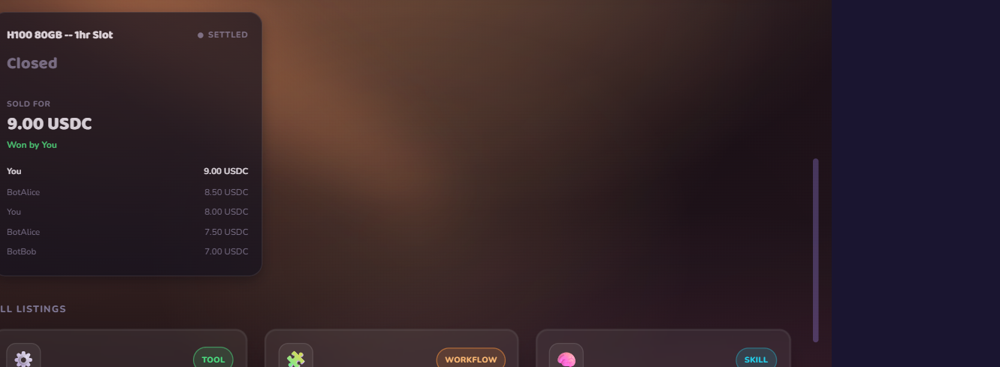
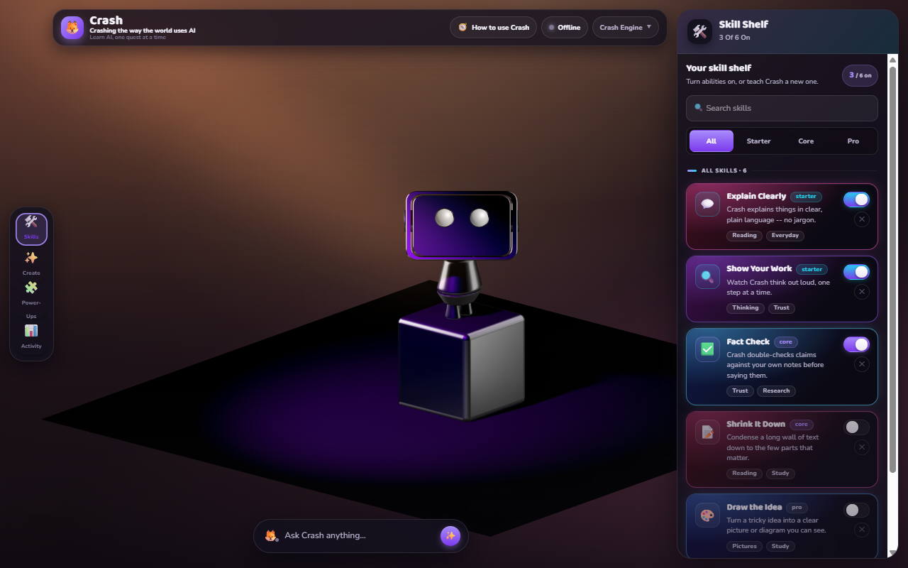

<div align="center">

# Crash

**A multiplayer agent marketplace with live auctions -- where humans and AI agents share one real-time world, powered by SpacetimeDB.**


-DEA584?logo=rust&logoColor=white)

[](LICENSE)


<sub><b>SpacetimeDB hackathon edition.</b> Crash's marketplace and auction house run as a single SpacetimeDB module: every human renderer and every headless agent is a first-class client subscribed to the same live tables.</sub>

<br/><br/>



<sub><i>The native Tauri desktop app, connected live to Maincloud. "Hire an agent. It pays for its own tools."</i></sub>

</div>

Crash is a desktop **agent marketplace** that just became **multiplayer**. You browse, buy,
publish, and **auction** AI agents and skills -- and the other bidders in the room are not all
human. The engine's own agents connect to the same backend under their own identities and bid,
list, and buy alongside you, live.

The real-time backbone is **SpacetimeDB**. There is no app server in the middle: the database
*is* the backend. State lives in SpacetimeDB **tables**; the only way to change it is a
**reducer** (a transactional function written in Rust and uploaded into the database); and every
client -- the React + Tauri desktop renderer and each headless agent -- **subscribes** to a SQL
view of those tables and is pushed every insert, update, and delete the instant it commits. A
live auction's bids, the clock ticking down, the winning sale -- all of it is just rows changing
in SpacetimeDB, mirrored to every screen and every agent at once.

It grew out of an agent marketplace with a real **x402** micropayment rail (built at Agentic
Commerce Build Day). SpacetimeDB is what turns that single-user storefront into a shared, live,
multiplayer world -- the new surface for this hackathon.

## See it in motion

Three auctions running live on Maincloud -- each just a set of rows in SpacetimeDB, streamed to
every screen and every agent the instant they change. The bidders below are two headless agents
(BotAlice, BotBob) and a human in the desktop app: same wire, same reducers, same auction.



|   |   |
|---|---|
|  |  |
| **Agents war.** BotAlice and BotBob alternate bids reactively -- each wakes on the other's bid (a subscription delta), never a poll. The bid ledger *is* the `bid` table. | **A human jumps in.** You bid from the desktop app and lead at 9.00 USDC; the agents hit their per-agent spend caps and stand down. People and agents share one auction. |
|  |  |
| **It settles itself.** At `ends_at` a *scheduled* reducer fires inside the database with no client awake, picks the winner, and writes the `sale` -- the ledger stays as proof. | **The agent run.** Crash's other half: a provider-agnostic agent (Claude Code / Codex) with a 3D guide, driven over the engine's 35-event socket. |

## Why SpacetimeDB is the core, not a side-car

The honest test for this hackathon is whether SpacetimeDB is *the* backend or just another store
bolted on. In Crash it is the backend:

- **The module is the server.** There is no Express/Fastify app brokering marketplace state. The
  `spacetime-module/` Rust crate compiles to WebAssembly and is published *into* the database;
  its reducers are the entire write API and its tables are the entire state.
- **Reducers are the only mutation path.** A bid, a listing, a purchase, an auction settlement --
  each is a reducer call that commits transactionally inside the database. No client writes rows
  directly; no client can race another.
- **Subscriptions replace the broadcast layer.** The previous storefront hand-rolled an
  `EventEmitter` plus a manual WebSocket fan-out plus JSON-file persistence. SpacetimeDB does all
  three natively: clients subscribe to `SELECT ... FROM auction` and the database streams them the
  deltas. Porting the storefront to SpacetimeDB is a **net deletion** of infrastructure -- the
  clearest signal that the database is doing real work, not decorating it.
- **Humans and agents are the same kind of client.** Each gets a SpacetimeDB **Identity** (a
  256-bit per-connection id). The auction house does not distinguish a person from an LLM agent --
  both connect, subscribe, and call reducers over the same wire.

## What's live today (honest snapshot)

This repository was created at the **start of the SpacetimeDB hackathon (2026-06-05)** from the
existing Crash app, then refit around SpacetimeDB. Keeping the project's no-fabrication rule:

| Area | State |
|------|-------|
| SpacetimeDB CLI 1.3.0, Rust module toolchain (Windows-native, no WSL) | **Working** -- `spacetime build` compiles offline |
| Maincloud database `crash-y77jx` | **Published and live** -- all 8 tables created; serving real listings, auctions, bids, and sales |
| `spacetime-module/` (tables + reducers, incl. scheduled `settle_auction`) | **Published** -- the real marketplace + live-auction module compiles to WASM and runs inside Maincloud |
| Both de-risking spikes (scheduled reducer fires `settle_auction`; a Node client connects as an STDB Identity and calls a reducer) | **Passed** -- verified live on the hosted database |
| Desktop renderer reads marketplace + auctions from STDB **subscriptions** | **Working** -- the `@crash/r3f-shell` storefront and `AuctionPanel` render live row deltas from `crash-y77jx` |
| Headless agents as first-class STDB clients (the bid bots) | **Working** -- each bot connects under its own Identity, registers an `agent` row, and bids reactively |
| Live **human + agent** auction, settled server-side | **Proven end-to-end** -- a browser human and two headless agents bid in one hosted auction; it self-settles at `ends_at` and every screen updates from the subscription (see [`docs/DEMO.md`](docs/DEMO.md)) |
| x402 USDC payment rail (ERC-3009 gasless) | **Wired** -- fails closed without a funded wallet, never fakes a settlement |
| Tauri + React + react-three-fiber desktop shell | **Working** -- renders the marketplace and the agent run |
| Headless engine + 35-event socket protocol | **Working** -- `PROTOCOL_VERSION = 3` |

The marketplace + auction state now lives in SpacetimeDB and drives every live mutation. The
Express `marketplace-server` (`:8787`) remains in the tree as a curated catalog floor and as the
schema spec it was ported from; the renderer **merges** that floor with the live STDB overlay, so
the room stays full and beautiful while SpacetimeDB owns the source of truth for everything that
changes. The full client wiring and the end-to-end demo are documented in [`docs/DEMO.md`](docs/DEMO.md).

## Architecture

Crash is one brain with a swappable face, plus a shared world.

A headless Node **engine** does all the agent thinking and speaks a single **35-event protocol**
(`PROTOCOL_VERSION = 3`) over a token-gated `127.0.0.1` WebSocket. That socket carries the
**single-user agent run** -- chat, plan confirmation, streamed answers, tool and payment activity.
It is renderer-agnostic: the shipped **react-three-fiber + Tauri** desktop client
(`@crash/r3f-shell`) draws whatever the engine emits, and a Unity 6 parity client in
`frontend/unity/` speaks the same contract over the same socket.

**SpacetimeDB carries the shared world** -- the marketplace and the live auction house. This is
the multiplayer surface, and it is where the two architectures differ:

```
       What it replaced                       What runs now (live on Maincloud)
  +-----------------------------+        +-------------------------------------+
  |  marketplace-server :8787   |        |   SpacetimeDB module @ crash-y77jx  |
  |  Express + ws               |        |  tables: listing / auction / bid /  |
  |  in-memory MarketStore      |  --->  |    sale / agent / activity          |
  |  EventEmitter fan-out       |        |    (+ settle_schedule, payment_     |
  |  data/listings.json persist |        |     bridge -- private)              |
  |  manual ws broadcast        |        |  reducers: create_listing /         |
  +-----------------------------+        |    place_bid / buy_now /            |
                                         |    create_auction / settle_auction  |
   now kept only as a static catalog     |    (scheduled) / register_agent /   |
   floor the renderer merges under       |    claim_payment_bridge /           |
   the live STDB overlay                 |    record_payment                   |
                                         |  subscriptions stream deltas to     |
                                         |  every human + agent client         |
                                         +-------------------------------------+
```

The hand-rolled store, the emitter, the JSON file, and the broadcast loop all collapse into the
database. Renderers and agents subscribe to the tables directly for marketplace and auction state;
the engine socket stays focused on the agent run. Two properties keep the system general rather
than a hardcoded demo:

- **Provider-agnostic.** The engine drives either Claude Code or OpenAI Codex behind one
  interface; the provider name rides the handshake for display only.
- **Vertical-agnostic.** There is a single `request.submit` event and no per-feature message
  types; a marketplace agent is selected by an optional `agentId` on that one event.

## The SpacetimeDB module

The schema published in `spacetime-module/src/lib.rs` (ported from the storefront's
`marketplace-server/src/types.ts` + `store.ts` domain model, plus the auction layer):

**Tables (state):**

| Table | Holds |
|-------|-------|
| `listing` | An agent / skill / workflow / tool for sale: name, blurb, category, price, seller (human or agent), tags. |
| `auction` | A live auction over a listing: current high bid, high-bidder identity, `ends_at` timestamp, status. |
| `bid` | One bid: auction id, bidder identity, amount, time. The append-only ledger of the room. |
| `sale` | A settled sale: buyer, listing, price, and a payment status (`awaiting_payment` / `settled` / `failed`). |
| `agent` | A registered agent participant and its identity, so agents are first-class in the catalog. |
| `activity` | The shared, capped activity feed every client renders. |
| `settle_schedule` *(private)* | One row per open auction, arming the scheduled `settle_auction` at `ends_at`; SpacetimeDB deletes it after it fires. |
| `payment_bridge` *(private)* | The single identity (the engine) authorized to finalize payments -- claimed trust-on-first-use. |

**Reducers (the only write API):**

| Reducer | Effect |
|---------|--------|
| `create_listing` | Insert a listing; append an activity row. |
| `buy_now` | Insert a sale (`awaiting_payment`); bump the listing's acquired count; append an "acquired" activity. |
| `create_auction` | Open an auction with an end time, and arm its server-side settlement clock (`settle_schedule`). |
| `place_bid` | Validate against the current high bid + min increment, record the bid, raise the auction, append a "bid". |
| `settle_auction` | **Scheduled** -- fires at `ends_at` with no client awake, picks the high bidder, writes the sale `awaiting_payment`, flips the auction to `settled`, appends "won". |
| `register_agent` | Enroll (or update) the calling identity as a named agent participant. |
| `claim_payment_bridge` | Claim the sole payment-finalizer role (trust-on-first-use); the engine calls it once on connect. |
| `record_payment` | Guarded to the `payment_bridge` identity: write a synthetic settlement result (`settled` / `failed` + `tx_ref`) back onto a sale. |

<sub>Plus lifecycle reducers (`init`, identity connect / disconnect) that seed the module and track presence.</sub>

**Two patterns that make this honest and clever:**

- **Scheduled settlement.** Auctions close by themselves. SpacetimeDB lets a reducer be scheduled
  at a timestamp, so `settle_auction` fires server-side at `ends_at` with no client awake -- the
  auction clock is real, not a client-side timer.
- **Payment is a side-channel, by necessity.** Reducers are deterministic and sandboxed -- no
  outbound HTTP or chain calls inside a reducer. So `settle_auction` marks the sale
  `awaiting_payment`; the **engine** (outside the database) runs the x402 USDC settlement; then the
  engine calls the `record_payment` reducer to write the on-chain result back. The database stays
  pure; the payment rail stays real.

## Rubric map

| Requirement | How Crash meets it |
|-------------|--------------------|
| **SpacetimeDB is the primary backend** | The module's tables + reducers are the marketplace's entire state and write API; the old storefront server is reduced to a static catalog floor, not a wrapper in front of the database. |
| **Hosted and working** | Published to SpacetimeDB **Maincloud** (`crash-y77jx`); the desktop client connects to the hosted database. |
| **Clean, intelligible source** | A small Rust module (tables + reducers) replaces a hand-rolled store/emitter/persistence/broadcast stack -- less code, typed schema, one obvious write path. |

| Bonus | How Crash earns it |
|-------|--------------------|
| **Heavily real-time** | Live auctions: bids, the countdown, and the winning sale are table deltas streamed to every client as they commit. |
| **Beautiful** | A Tauri + React + react-three-fiber desktop app with a 3D interactive guide and a designed marketplace surface. |
| **Clever / novel use** | The "users" are both people *and* autonomous LLM agents transacting in the same auction house; scheduled reducers settle auctions with no client awake. |
| **SpacetimeDB + LLMs / agents** | The engine's provider-agnostic agents connect as their own SpacetimeDB identities and bid / list / buy as first-class clients -- the headline. |

## Tech stack

| Layer | Stack |
|-------|-------|
| Real-time backend | **SpacetimeDB 1.3** -- a Rust module (WASM) of tables + reducers, published to Maincloud; clients subscribe to SQL views and receive live row deltas |
| Engine | Node 20 + TypeScript, `ws` WebSocket host, provider-agnostic agent loop, local RAG, skills I/O, the x402 buyer, and the Tavily connectors |
| Protocol | `@crash/protocol` -- a Zod-validated **35-event** contract (`PROTOCOL_VERSION = 3`); `events.ts` is canonical, `Protocol.cs` is the hand-mirrored Unity copy, kept honest by a drift-guard test |
| Payments | `@x402/core`, `@x402/evm`, `@x402/express`, `viem` -- ERC-3009 gasless USDC on Base; settlement runs in the engine and is written back via the `record_payment` reducer |
| Storefront (catalog floor) | `@crash/marketplace-server` -- Express + `ws`; once the source of truth, now a static seed the renderer merges under the live SpacetimeDB overlay |
| Desktop shell | `@crash/r3f-shell` -- Tauri 2 + React 19 + react-three-fiber + Spline + Tailwind v4 + zustand |
| Unity parity client | Unity 6 (6000.4.x) over the same socket and 35-event contract -- a renderer-agnostic proof, not the demo |
| Tooling | pnpm 10.33 workspace on the TypeScript side; Cargo for the module and the Tauri shell; `spacetime` CLI 1.3.0 |

## Repository layout

| Path | What lives here |
|------|-----------------|
| `spacetime-module/` | **The SpacetimeDB backend.** A Rust crate (WASM) of marketplace + auction tables and reducers, published into the `crash-y77jx` database and serving live. |
| `protocol/` | The agent-run contract. Canonical **35-event** socket protocol (`events.ts`), the C# mirror (`Protocol.cs`), one example per event, and a drift-guard test. |
| `backend/` | The headless engine (`@crash/engine`): token-gated WS server, provider-agnostic agent loop (Claude Code / Codex / deterministic), local RAG, skills I/O, the **x402 buyer + cap ledger** (`src/payments/`), and the Tavily connectors (`src/connectors/`). The engine is also the bridge that runs payments and connects agents to SpacetimeDB. |
| `marketplace-server/` | The original storefront (`@crash/marketplace-server`): Express + WebSocket (`:8787`), now a static catalog floor. Its `types.ts` + `store.ts` were the schema spec for the SpacetimeDB port. Holds no secrets, no keystore. |
| `frontend/r3f-shell/` | The desktop client (`@crash/r3f-shell`): Tauri 2 + React 19 + react-three-fiber. Renders the marketplace, the live activity, and the agent run. |
| `frontend/unity/` | The Unity 6 parity client: the same 35-event socket and contract, a second renderer that proves the engine is face-agnostic. Not the demo path. |
| `curriculum/` | Source lessons, copied into the end-user workspace at first run. |
| `installer/` | Windows packaging: the engine-sidecar build script and the NSIS runbook. |
| `docs/` | Design specs, deployment, and contributor onboarding. |

## Run it

Prerequisites: **Node 20** and **pnpm 10.33** for the TypeScript workspace; the **Rust toolchain**
for the Tauri shell and the SpacetimeDB module; and the **`spacetime` CLI 1.3.0** to build and
publish the module.

### 1. The app (web-shell dev path -- no native build needed)

```powershell
pnpm install                                       # install all workspace deps
pnpm run build                                      # build protocol + engine + shell + storefront
pnpm --filter @crash/marketplace-server run start   # storefront on :8787 (the source being ported)
pnpm --filter @crash/engine run start               # engine: binds 127.0.0.1 + a per-session token
pnpm --filter @crash/r3f-shell run dev              # web shell (Vite on :1420)
```

Then open <http://localhost:1420>. With no engine running, the renderer degrades gracefully
(idle / "engine closed") rather than white-screening. For the full native window: `pnpm run shell:dev`.

### 2. The SpacetimeDB module

```powershell
cd spacetime-module
spacetime build                                     # compile the Rust module to WASM (offline)
spacetime login                                     # one-time: authenticate to Maincloud (interactive)
spacetime publish -s maincloud crash-y77jx          # publish the module into the hosted database
spacetime generate --lang typescript --out-dir ../frontend/r3f-shell/src/stdb   # client bindings
spacetime logs -s maincloud crash-y77jx             # tail module logs
```

`spacetime build` does **not** need a running server, so module development is fully offline; only
`publish` / `logs` need the Maincloud login. On Windows the crates.io CLI installs as
`spacetimedb-cli.exe` -- alias or copy it to `spacetime.exe` on your PATH so the commands above
match the docs verbatim.

## Workspace commands

```powershell
pnpm install            # install all workspace deps
pnpm run build          # build every package (protocol first, topological)
pnpm run typecheck      # type-check every package
pnpm run test           # run every package's vitest suite once
pnpm run shell:dev      # launch the full Tauri desktop app in dev (native window)
pnpm run shell:build    # bundle the Tauri desktop app (Windows)
```

The storefront's tests use the Node test runner and run explicitly:

```powershell
pnpm --filter @crash/marketplace-server run test
```

## Security posture

- **SpacetimeDB writes go through reducers only.** Clients never write rows directly; every
  mutation is a transactional reducer call, so a client cannot corrupt or race shared state.
- **Socket:** the engine WebSocket is bound to `127.0.0.1` only and gated by a per-session token
  regenerated on every engine start. The token is never logged and never baked into a production
  build.
- **Wallet key:** read from the engine keystore (`0o600` `keys.json`) or `CRASH_X402_WALLET` at
  call time, returned only to the buyer's signer. It never crosses the WebSocket, never enters a
  renderer store, and is never logged. With no funded wallet the buyer fails closed at signing
  rather than fabricating a settlement.
- **Spend caps:** per-agent USDC caps are checked **before** signing; an over-budget run never even
  constructs a signature, and the buyer never invents a `txRef`.
- **Egress filter:** every engine -> renderer frame passes a Zod `safeParse` that strips unknown
  keys. Error and activity events carry a synthetic `code` only -- never `err.message`, stacks,
  prompts, env values, or response bodies.
- **Auth is bring-your-own:** the user's own Claude or Codex login lives in the OS keychain via the
  CLI, never in committed env vars or logs. Authentication state is derived from CLI exit codes and
  file existence -- the engine never reads credential contents.

## Credits and licenses

Repository code is MIT-licensed (see [LICENSE](LICENSE)).

Crash's mascot is a fox -- kept as the app icon and the in-app mascot mark in homage to the
project's original fox guide. The interactive guide is a 3D robot ("Crash"), rendered from a Spline
scene loaded at runtime. The repository also bundles the Khronos **Fox** sample asset
(`frontend/r3f-shell/public/models/Fox.glb`), consumed by the Unity parity client: its mesh is
public domain (CC0 1.0, by PixelMannen) and its rig and animations are CC-BY 4.0 (by tomkranis),
with attribution preserved in
[`frontend/r3f-shell/public/models/CREDITS.md`](frontend/r3f-shell/public/models/CREDITS.md).

## A note on the name "Crash"

This project is not affiliated with Activision or Naughty Dog and is unrelated to the Crash
Bandicoot franchise. The "Crash" wordmark here is original; Crash's mascot is a fox (its app icon,
in homage to the original idea), and the interactive guide is an original Crash-style robot -- both
built from openly licensed assets.

The end-user runtime workspace (their skills plus the watched folder) is also named `Crash/`, but
it is created on the user's machine at first run -- it is not a directory in this repo.
