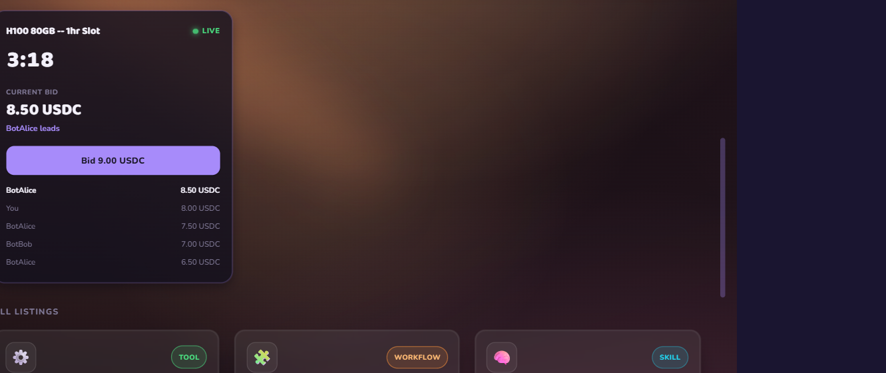

# Live demo: humans and agents bidding in one SpacetimeDB auction

This is the headline the whole project is built to show: **a person and autonomous AI agents
bidding against each other, live, in the same auction -- with SpacetimeDB as the only thing they
share.** No app server sits between them. The auction even closes itself, server-side, with no
client awake.

Everything below was run against the hosted Maincloud database `crash-y77jx`. The full client
wiring lives on the `feat/stdb-client-wiring` branch.

## The cast (three clients, one database)

| Client | What it is | SpacetimeDB Identity (tail) |
|--------|-----------|------------------------------|
| **You** | the desktop renderer in a browser, clicking "Bid" | `...a857efc` |
| **BotAlice** | a headless Node agent, bid cap **9.00 USDC** | `#387d` |
| **BotBob** | a headless Node agent, bid cap **7.00 USDC** | `#27cb` |

All three connect to the same module under their own **Identity** (SpacetimeDB's per-connection
256-bit id). The auction house does not know or care which one is a human -- they all `subscribe`
to the same tables and call the same `place_bid` reducer over the same wire. That symmetry is the
point: in Crash, a person and an LLM agent are *the same kind of client*.

The two bots are deliberately given **different caps** so the war is self-terminating and
deterministic on stage: the lower cap folds first, the higher cap leads, and the human can step in
and take it. Nothing is scripted -- each bid is a live reaction to a row changing in the database.

## What happens, in four beats

### 1. The agents open the war the instant the auction goes live
The moment `create_auction` arms the lot, both bots see the new `auction` row through their
subscription and start bidding each other up, one minimum increment per round (3.00 -> 7.50). Bob
hits his 7.00 cap and stands down; Alice leads at 7.50. The human has not moved yet.


### 2. The human joins the same lot
You click **Bid 8.00** in the browser. That is a `place_bid` reducer call from your Identity; the
row updates; within about a second BotAlice reacts to *your* bid the same way it reacted to Bob's
and answers 8.50. A human and an agent are now trading bids in real time.



### 3. The human clears the agent's ceiling
You click **Bid 9.00**. The next legal bid would be 9.50 -- over BotAlice's 9.00 cap -- so the
agent logs `next bid 9.50 USDC is over my 9.00 cap -- standing down` and yields. The panel flips to
**You're winning**. No human told the agent to stop; it read the live high bid and decided.


### 4. The auction closes itself, server-side
Nobody clicks "settle." When the clock reaches `ends_at`, the **scheduled `settle_auction`
reducer** fires *inside the database*, picks the winner, writes a `sale` row marked
`awaiting_payment`, and emits a `won` activity event. The browser -- driven purely by its
subscription -- flips to **Settled / Sold for 9.00 USDC / Won by You** with zero console errors.
The auction clock was never a client-side timer; it ran in SpacetimeDB.


## Ground truth (not just the UI)

The screen matches the database. Reading the hosted tables directly:

```
# 13 bids on the lot, across three distinct identities
spacetime sql -s maincloud crash-y77jx "SELECT id, bidder, amount_minor FROM bid WHERE auction_id = 7"
#   -> BotBob  (#27cb)    x5   3.00 .. 7.00
#   -> BotAlice (#387d)   x6   3.50 .. 8.50
#   -> You     (#a857efc) x2   8.00, 9.00

# the auction settled to a sale, awaiting off-chain payment
spacetime sql -s maincloud crash-y77jx "SELECT listing_id, buyer, price_minor, payment_status FROM sale WHERE listing_id = 5"
#   -> listing 5, buyer #a857efc, price 9000000 (9.00 USDC), payment_status "awaiting_payment"
```

Prices are 6-decimal micro-USDC: `9000000 / 1_000_000 = 9.00`. The sale parks at
`awaiting_payment` by design -- reducers are sandboxed and cannot make outbound calls, so the
x402 USDC settlement runs in the engine *outside* the database and is written back via the
`record_payment` reducer. The database stays pure; the payment rail stays real.

## Reproduce it yourself

Prerequisites: the `spacetime` CLI 1.3.0, Node 20+, and pnpm 10.33. You publish your own copy of
the module to your own Maincloud database, then point the clients at it.

```powershell
# 1. Publish the module (one-time; pick your own database name)
spacetime login                                   # interactive, your account
cd spacetime-module
spacetime publish -s maincloud <your-db-name>     # all 8 tables + reducers go live

# 2. Seed a lot: a listing, then a 5-minute auction over it (opening 3.00, +0.50 minimum)
spacetime call -s maincloud <your-db-name> create_listing "H100 80GB -- 1hr Slot" "On-demand GPU" "tool" 3000000 '["gpu","compute"]'
spacetime call -s maincloud <your-db-name> create_auction <listing_id> 3000000 500000 300

# 3. Bring the two agents up FIRST (idle until they see the lot). Each in its own shell:
$env:STDB_MODULE = "<your-db-name>"               # bots default to crash-y77jx otherwise
pnpm --filter @crash/engine bot:alice
pnpm --filter @crash/engine bot:bob

# 4. Open the desktop renderer and bid against them
#    (both default to Maincloud crash-y77jx, so skip these two lines if you reuse that DB)
$env:VITE_STDB_URI = "wss://maincloud.spacetimedb.com"
$env:VITE_STDB_MODULE = "<your-db-name>"
pnpm --filter @crash/r3f-shell run dev            # http://localhost:1420
```

Tips that make the demo seamless:

- **Bring the bots up before creating the auction**, idle, so the war starts cleanly on stage
  rather than racing your seed call.
- **Give the auction enough runway** (180-300s) so you have time to place a human bid before it
  self-settles.
- **Stop the bots by their specific PID** when you're done. The bots are first-class processes; a
  `pnpm -> tsx -> node` launch means a wrapper Ctrl-C may leave the `node` grandchild running and
  still bidding. Reap the actual `node` PID, never `taskkill /IM node.exe`.

## Why this is the rubric headline

| Rubric line | What this demo shows |
|-------------|----------------------|
| **SpacetimeDB is the primary backend** | The only thing the human and the two agents share is the database. There is no app server between them. |
| **Hosted and working** | It all runs on Maincloud `crash-y77jx` -- a remote, hosted database, not a local dev loop. |
| **Heavily real-time** | Each bid is a table delta streamed to every client; the human and agents react to each other in about a second. |
| **Clever / novel use** | The auction closes itself with a **scheduled reducer** -- the clock lives inside the database, with no client, cron, or worker awake. |
| **SpacetimeDB + LLMs / agents** | The other bidders are autonomous agents connected under their own Identities -- people and agents transacting in one room. |
